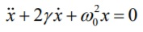
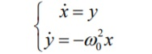
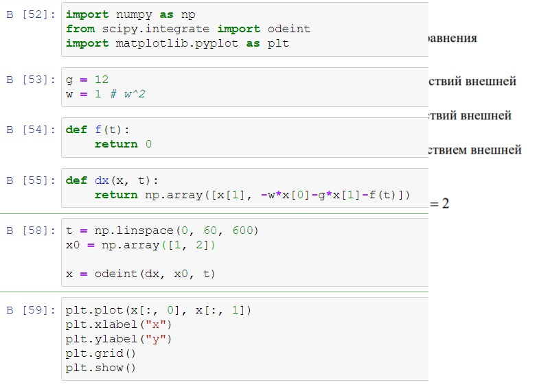
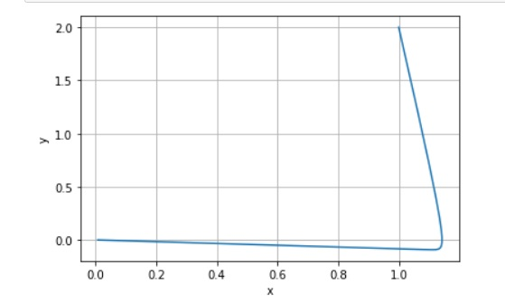

---
## Front matter
lang: ru-RU
title: Structural approach to the deep learning method
author: |
	Kuchenov I.V\inst{1,3}

## Formatting
toc: false
slide_level: 2
theme: metropolis
header-includes:
 - \metroset{progressbar=frametitle,sectionpage=progressbar,numbering=fraction}
 - '\makeatletter'
 - '\beamer@ignorenonframefalse'
 - '\makeatother'
aspectratio: 43
section-titles: true
---

# Модель гармонических колебаний

## Постановка задачи

Построить фазовый портрет гармонического осциллятора и решение уравнения
гармонического осциллятора для следующих случаев.

## Цель

Цель - Проверить, как работает модель в различных ситуациях.

### Теоретическая часть:

1. Теоретическая часть.

Уравнение свободных колебаний гармонического осциллятора имеет
следующий вид:

{ #fig:001 width=70% }

Уравнение второго порядка можно представить в виде системы двух
уравнений первого порядка:

{ #fig:001 width=70% }

Независимые переменные x, y определяют пространство, в котором «движется» решение. Это фазовое пространство системы, поскольку оно двумерно будем называть его фазовой плоскостью. Значение фазовых координат x, y в любой момент времени полностью определяет состояние системы. Решению уравнения движения как функции времени отвечает гладкая кривая в фазовой плоскости. Она называется фазовой траекторией. Если множество различных решений (соответствующих различным начальным условиям) изобразить на одной фазовой плоскости, возникает общая картина поведения системы. Такую картину, образованную набором фазовых траекторий, называют фазовым портретом.

# Ход решения

Мои значения:
{ #fig:001 width=70% }

Код:
{ #fig:001 width=70% }

Построение графиков:
Графики:

Первый случай:
{ #fig:001 width=70% }

Второй случай:
{ #fig:001 width=70% }

Третий случай:
{ #fig:001 width=70% }

# Выводы
Результат: Построили графики и увидели различия при разных коэфицентах.

Вывод: Построили математическую модель, использовали python, выявили результаты для трех случаев, научились строить математическую модель для нахождения исхода и результатов.
